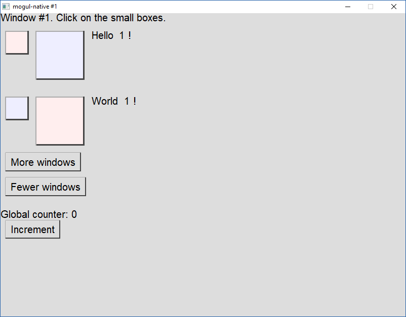

An experiment that could one day become a flexible GUI library for Kotlin (JVM and Native) inspired by [React](https://reactjs.org/).

If you just want to download a binary to run it, check out the releases github tab.

Here's a gif of fiddling around with the live reload (sped up 50%, real-time refresh delay is about a second on Windows).


The live reload currently only works on the JVM.

This is how a basic component looks

```kotlin
data class HelloProps(val name: String)

@GenerateBuilders
class Hello : Component<HelloProps> {
    override fun render() {
        return gui {
            box(style = style{ backgroundColor = 0xFFFFFF.color }) {
                -"Hello, ${props.name}!"
            }
        }
    }
}
```

An annotation processor (JVM-only for now, but you can just copy the generated code over to the native version, or write it by hand) will automatically generate a `hello` [builder](https://kotlinlang.org/docs/reference/type-safe-builders.html) you can use inside the `gui` DSL.

```kotlin
gui {
    hello(name="Alex")
}
```

I also tried to re-create some parts of [MobX](https://mobx.js.org/) (somewhat limited by language capabilities), if you prefer using mutable observables.

```kotlin
@GenerateBuilders(observer = true)
class KobxCounter(kobx: KobX) : Component<Unit>() {

    var count by kobx.observable(0)

    override fun render(): Element {
        return gui {
            layoutBox {
                -"Local count using observables: $count"
                button(text="Increment", onClick = this@KobxCounter::incrementCounter)
            }
        }
    }

    fun incrementCounter(event: MouseEvent) {
        count++
    }
}
```

Later, I might also rip off some parts of [Redux](http://redux.js.org/), or use one of the existing "Redux in Kotlin" libraries.

Here's a screenshot, as you can see, it's not practically usable at the moment. I will worry about the look later.



Right now the code is pretty hacky, has pretty bad performance and a lot of TODO comments, but I will be cleaning that up soon. I completely avoided reflection in order to support Kotlin Native. If it ever gets more reflection capabilities, the code could be nicer, especially the part that deals with injecting dependencies into components.

The React design is followed pretty closely right now, but over time, I might gradually change it into something more suitable for Kotlin. For now, it also has most of the React 15 limitations and issues (no Fiber yet).

Implementation-wise, it's currently using [SDL](http://libsdl.org/) for window management and [cairo](https://www.cairographics.org/) for drawing. In the future, I might use [pango](http://www.pango.org/) for text layout or switch to [Skia](https://skia.org/) (which will need a C wrapper for its C++ API).

There is a very simple scene graph library that acts as a DOM, but the aim is most definitely not to reinvent HTML or SVG with all of their complexities. There will only be a fairly minimal set of features for flexbox-like layout. Rectangles and text are basically all that's needed (plus some other shapes). Not having to support so many features and possible cases should also help performance (and of course size). Compared to the actual browser DOM, it is also possible to write completely new low-level elements as part of an application or a library, so that you can only include those that your application actually needs.

Styles are defined with CSS-like Style objects, because I like how they can be composed together (`style = buttonStyle + redBorders`) and inherited by child components.

For the general idea, see https://www.reddit.com/r/programmingcirclejerk/comments/72hvwj/feat_request_add_a_loading_splash_screen_to_my/dnixh4h/ and the other links in that comment.

